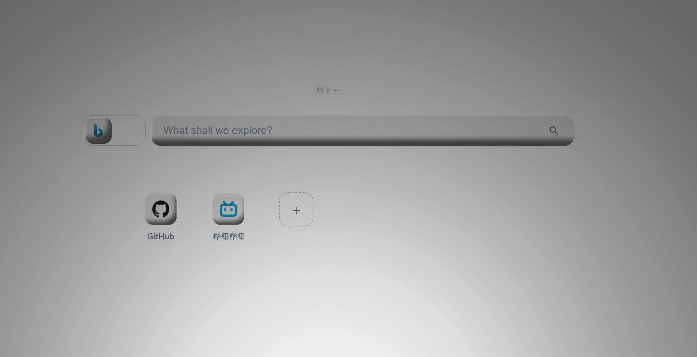

# Explorer Home Page

一个 **Edge 浏览器主页扩展**

## 功能一览

| 功能 | 说明 |
| --- | --- |
| 📶 网络角标 | **实时显示**网络连通情况和延迟 |
| 🔍 切换搜索引擎 | 可切换 必应 / Google **两个搜索引擎** |
| 🧭 快捷方式 | 自由增删改、**拖拽排序**常用网站 |
| ⚙️ 设置页 | 配色、光影、签名、数据**全部可自定义**，修改立即生效 |
| ✨ 页面效果 | 跟随鼠标移动的**动态阴影** |
| 💾 数据本地化 | 全部数据均保存在**本地**，支持一键导出/导入 JSON 备份 |

## 安装

请前往本仓库的 **[Releases 页面](https://github.com/CaulCaul/ExplorerHomePage/releases)**，
下载最新版本的压缩包并按 Release 说明中的步骤安装。

> ⚠️ 如果之前安装过其他「新标签页/主页」类扩展（Infinity、Tabliss 等），它们会互相抢占新标签页，请在扩展页把其他同类扩展禁用。

## 数据安全

你的**搜索历史、快捷方式、引擎偏好**保存在 Edge 浏览器的**扩展本地存储**（`chrome.storage.local`）中：

- 与仓库文件无关——删除/重新克隆仓库不会丢数据；
- 从**同一个路径**重新加载扩展，数据保持连续；
- ⚠️ Edge「清除浏览数据 → Cookie 和其他站点数据」会清空这些数据，清理前请先导出；
- ⚠️ 卸载扩展会清空这些数据。

## 更新

从 [Releases](https://github.com/CaulCaul/ExplorerHomePage/releases) 下载新版本压缩包，
解压**覆盖**原安装文件夹的全部内容，再到 `edge://extensions` 点击「Explorer Home Page」卡片上的「重新加载」即可。
